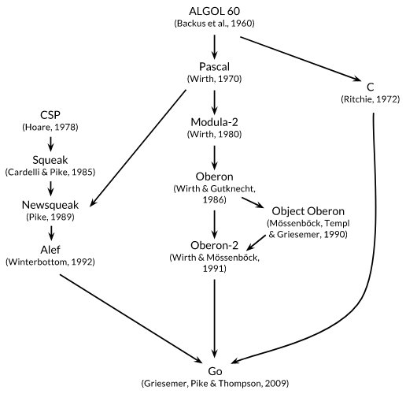

<div align="center">
    <h1>Workshop Golang</h1>
    <br/>
    
    <br/>
    <h3>
        "Crie software rápido, confiável e eficiente em escala" -
        <a href="https://go.dev">Go</a>
    </h3>
</div>

## Objetivo

* Falar sobre as características do Golang
* Mostrar quem esta usando Golang
* Falar sobre a origem do Golang
* Mostrar sintaxe e exemplos práticos

## Características do Golang

* Tipagem estática e forte com suporte a inferência
* Programação estruturada (estrutura condicional, repetição, iteração e etc)
* Programação imperativo (*goto*)
* Programação concorrente (*goroutines*, *channels*)
* Organização de código por *packages*
* Criou o comando *defer*
* Contém coletor de lixo(*garbage collector*)
* Contém ponteiros com uso seguro e simplificado
* Pseudo-Orienteado a Objetos (*structs*)
* Suporte a *generics* (lançado em 2022 na versão 1.18, [veja](https://go.dev/doc/devel/release#go1.18))
* *Struct Tags*, semelhantes as *annotations* do Java
* Eficiente na compilação e execução
* Pode ser usado em computação gráfica, aplicações móveis, web, *machine learning*, redes, ferramentas de linha de comando e entre outros
* Semelhança superficial a liguagem C
* Interoperável com a linguagem C
* Retrocompatibilidade com versões anteriories

Para instalar acesse o site oficial do [Go](https://go.dev).

## Empresas que usam Golang

* Google
* Pagar.me
* Cockroach Labs
* Mercado Livre
* Netflix
* PicPay
* Bitly
* Microsoft
* Meta
* Dropbox
* Uber
* Twitch
* SalesForce
* Twitter
* Riot Games
* Cloudflare
* Eucard
* TC - Traders Club
* Docker
* Kubernetes
* CoreDNS
* Etcd
* HashiCorp (Terraform)
* Ecocentauro
* Entre várias outras!

## História do Golang

* Surgiu dentro da Google em 2007 e publicado em 2009
* Os principais desenvolvedores foram Robert Griesemer, Rob Pike e Ken Thompson
* Influenciado por diversas linguagens

<div align="center">
    
</div>

* Uma das influências veio de linguagens de pesquisas criadas na Bell Labs inspiradas no conceito [**CSP (communicating sequential proccess)**](https://pt.wikipedia.org/wiki/CSP_(matem%C3%A1tica)), de [Tony Hoare](https://pt.wikipedia.org/wiki/Charles_Antony_Richard_Hoare) em 1978, sobre os fundamentos da concorrência

> Em CSP, um programa é uma composição paralela de processos que não têm estados compartilhados; os processos se comunicam e se sincronizam usando canais. - [A Linguagem de Programação Go (livro)](https://www.amazon.com.br/Linguagem-Programa%C3%A7%C3%A3o-Go-Alan-Donovan/dp/8575225464/ref=sr_1_1?__mk_pt_BR=%C3%85M%C3%85%C5%BD%C3%95%C3%91&crid=150VO5W82ZUWY&keywords=go&qid=1654641511&sprefix=golang%2Caps%2C234&sr=8-1&ufe=app_do%3Aamzn1.fos.6d798eae-cadf-45de-946a-f477d47705b9)

* Go nasceu da frustração de vários sistemas complexos desenvolvidos pela Google

## A linguagem Go

* Um *"Hello World"* pra comerçar:

```go
// Define pacote principal semelhante a classe principal do Java
package main

// Importa package padrão fmt usado para operações de I/O
// ler entradas do teclado ou imprimir textos na saída padrão
import "fmt"

// Função principal(ponto de partida) semelhante ao "main" do C ou
// o "public static void main" do Java
func main() {
    // Chama função do package fmt para imprimir na saída padrão
    // um "Hello World"
    fmt.Println("Hello World")
}
```

* Projeto de exemplo: [contactsd](https://github.com/Felyp-Henrique/contactsd)

* [Sintaxe em geral](codigos)

## Conheça mais

* [Go Tour](https://go.dev/tour/welcome/1)
* [Go by Example (tutorias)](https://gobyexample.com/)
* [Awesome Go (repositório)](https://github.com/avelino/awesome-go)
* [A Linguagem de Programação Go (livro)](https://www.amazon.com.br/Linguagem-Programa%C3%A7%C3%A3o-Go-Alan-Donovan/dp/8575225464/ref=sr_1_1?__mk_pt_BR=%C3%85M%C3%85%C5%BD%C3%95%C3%91&crid=150VO5W82ZUWY&keywords=go&qid=1654641511&sprefix=golang%2Caps%2C234&sr=8-1&ufe=app_do%3Aamzn1.fos.6d798eae-cadf-45de-946a-f477d47705b9)


## Fontes

* [Site Oficial](https://go.dev)
* [A Linguagem de Programação Go (livro)](https://www.amazon.com.br/Linguagem-Programa%C3%A7%C3%A3o-Go-Alan-Donovan/dp/8575225464/ref=sr_1_1?__mk_pt_BR=%C3%85M%C3%85%C5%BD%C3%95%C3%91&crid=150VO5W82ZUWY&keywords=go&qid=1654641511&sprefix=golang%2Caps%2C234&sr=8-1&ufe=app_do%3Aamzn1.fos.6d798eae-cadf-45de-946a-f477d47705b9)
* [Go By Example](https://gobyexample.com/)
